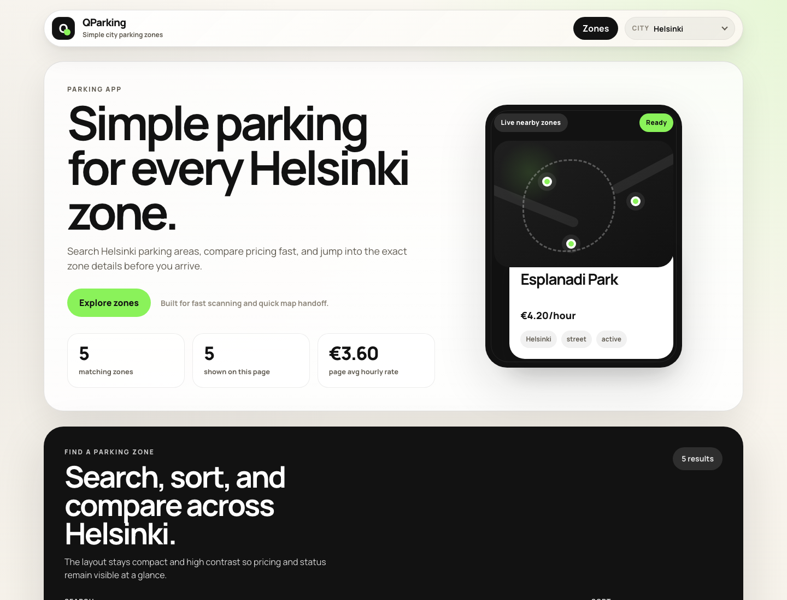
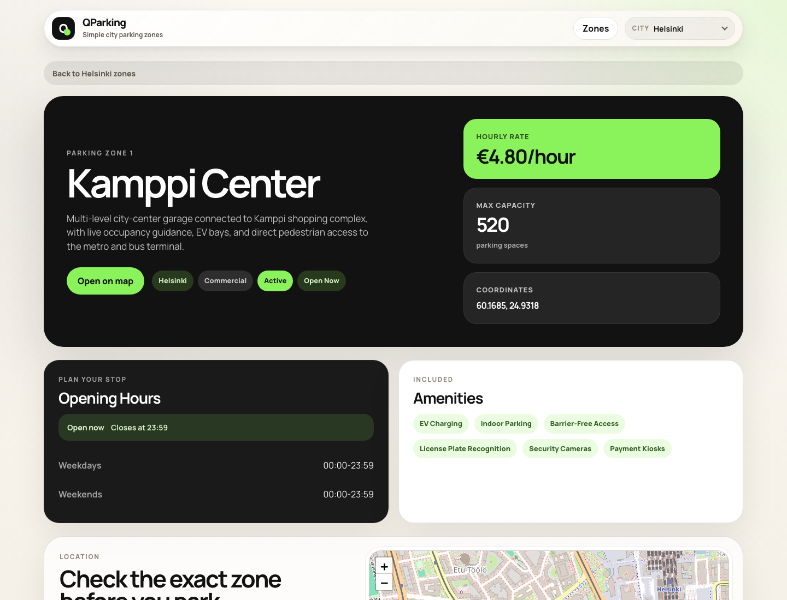
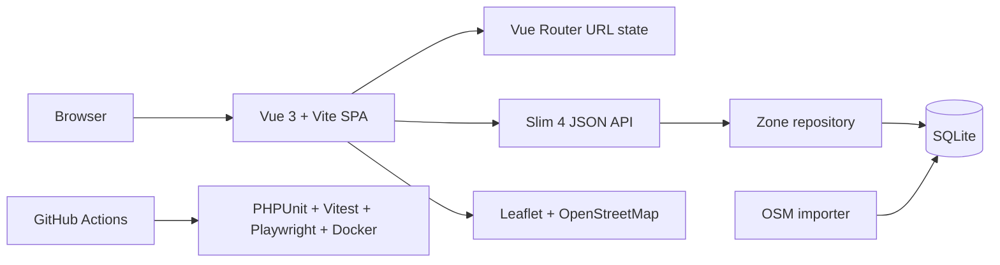

#  QParking Zones


QParking Zones is a polished full-stack showcase for discovering parking areas across Helsinki, Espoo, and Vantaa. It pairs a responsive Vue search experience with a Slim API, deterministic OpenStreetMap imports, SQLite persistence, Docker delivery, and automated test coverage.

## Highlights

- Search, filter, sort, paginate, and share parking-zone results through URL state
- Discover nearby parking with browser geolocation and distance-based sorting
- Open detail pages with pricing, capacity, opening status, amenities, coordinates, and maps
- Import real parking locations from `OpenStreetMap + Overpass API`
- Run the full stack locally, through Docker Compose, or as a production-style Nginx/API setup
- Validate behavior with PHPUnit, Vitest, Playwright, linting, audits, and CI checks

## Product Preview





## Architecture



| Area | Purpose | Stack |
| --- | --- | --- |
| Web | Catalog, filters, detail pages, maps | `Vue 3`, `TypeScript`, `Vite`, `Vue Router`, `Leaflet` |
| API | Validated JSON endpoints and query contracts | `PHP 8.3`, `Slim 4`, `PDO` |
| Data | Seed data, OSM imports, deterministic upserts | `SQLite`, schema constraints, source metadata |
| Delivery | Repeatable local and production-style runtime | `Docker`, `Docker Compose`, `Nginx`, `Caddy` |

## Quick Start

### Local Development

Requirements: `PHP 8.3+`, `Composer`, `Node.js 20+`, and `npm`.

```bash
cd apps/api
composer install
composer run db:init
php -S localhost:8000 -t public
```

```bash
cd apps/web
npm install
cp .env.example .env
npm run dev
```

Default URLs:

- Web: `http://localhost:5173/#/`
- API: `http://localhost:8000/api/zones`

### Docker

```bash
docker compose -f infra/docker/docker-compose.yml up --build
```

For a production-style static frontend and private backend network:

```bash
docker compose -f infra/docker/docker-compose.prod.yml up -d --build
```

## Real Data

The app ships with development seed data in `apps/api/database/seed.sql`. To replace it with real parking data from OpenStreetMap:

```bash
cd apps/api
php scripts/import-zones.php
```

The importer stores source metadata and upserts by source identity, so repeated imports refresh existing rows instead of creating duplicates. Live occupancy integrations are intentionally left behind feature flags/placeholders for future provider work.

## API Snapshot

| Endpoint | Description |
| --- | --- |
| `GET /api/zones` | Paginated parking-zone summaries with city, keyword, type, status, amenity, open-now, distance, radius, sort, page, and limit filters |
| `GET /api/zones/{id}` | Full detail payload for one parking zone |
| `GET /api/health` | Lightweight health and zone-count response |

Invalid query values return a JSON error with an appropriate HTTP status.

## Quality Checks

```bash
make ci
make test
make test-e2e
make audit
make build
```

Individual app checks:

```bash
cd apps/api && composer test
cd apps/web && npm run lint && npm run test:run && npm run build && npm run test:e2e
```

## Project Structure

```text
apps/
  api/      Slim API, SQLite schema, seed data, importer, PHPUnit tests
  web/      Vue SPA, API client, views, components, Vitest and Playwright tests
docs/       README icons and product screenshots
infra/      Docker, Nginx, and Caddy deployment assets
```

## Roadmap

- Add real-time occupancy/status providers
- Introduce map-first browsing with clustered markers
- Expand data confidence indicators for inferred price and opening-hour fields
- Add favorites, history, and frequently used destinations
