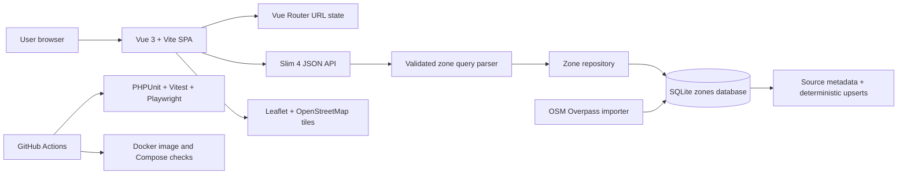

#  QParking Zones


QParking Zones is a full-stack parking-zone explorer for Helsinki, Espoo, and Vantaa. It combines a compact Vue search experience, a Slim API, deterministic OpenStreetMap imports, SQLite persistence, and Docker-based delivery checks.

## 1. Project Overview

The goal of this project is to detect and expose parking area data for the Helsinki metropolitan region and provide a simple parking search experience for end users:

- Coverage across `Helsinki`, `Espoo`, and `Vantaa`
- Nearby parking discovery based on the user's current location
- Filtering by price, status, amenities, and distance
- Dedicated parking detail pages with map support

At the moment, the project focuses on parking facilities and parking zones, not real-time free-space availability. The codebase already contains configuration placeholders for live availability providers, but those integrations are not yet exposed through the public API routes.

## 2. Product Preview

### Catalog Experience

The first screen is the working product, not a marketing page: city selection, summary metrics, search, sorting, filters, pagination, and shareable URL state.


### Zone Detail Experience

The detail page focuses on decision support: hourly price, capacity, opening status, amenities, exact coordinates, and an embedded OpenStreetMap preview.


## 3. Architecture



### System Slices

| Slice | Role | Implementation |
| --- | --- | --- |
|  Web app | Search, filter, compare, and open parking details | `Vue 3`, `TypeScript`, `Vue Router`, `Leaflet` |
|  API | Validates query contracts and returns JSON responses | `Slim 4`, `PDO`, custom query parser |
|  Data | Stores seed data and deterministic OSM imports | `SQLite`, JSON constraints, source identity indexes |
|  Delivery | Keeps the project reproducible and deployable | `Docker`, `Nginx`, `Caddy`, `GitHub Actions` |

## 4. Core Features and Real Data Sources

### Core Features

- Browse parking zones by city
- Search zones by name
- Filter by `type`, `amenities`, and `open now`
- Sort by distance after geolocation is granted, with optional radius filtering
- View zone details including pricing, capacity, opening hours, amenities, and coordinates
- Show an embedded `Leaflet + OpenStreetMap` map on the detail page
- Persist catalog filters in the URL so results are shareable
- Provide both frontend and backend test coverage for development and regression checks

### Where the Real Data Comes From

The repository currently works with two kinds of data:

- Default development data from `apps/api/database/seed.sql`
- Real parking data imported by `apps/api/scripts/import-zones.php` from `OpenStreetMap + Overpass API` for the Helsinki, Espoo, and Vantaa region, then stored locally in `SQLite`

### Free Ways to Access Real Parking Data

Based on the current repository implementation and configuration, there are two practical free data-access approaches:

- `OpenStreetMap + Overpass API`
  - Already implemented in this project
  - Suitable for retrieving parking locations, names, capacities, and selected tag metadata
- Public city or operator APIs
  - The repository already includes placeholder configuration for `Parkkiopas/Parkkihubi` and `Fintraffic/LIIPI`
  - These are not yet connected to the public API routes, but they represent the next likely integration path


## 5. Tech Stack

- Frontend: `Vue 3`, `TypeScript`, `Vite`, `Vue Router`, `Leaflet`
- Backend: `PHP 8.3`, `Slim 4`, `PDO`, `SQLite`
- Testing: `Vitest`, `Vue Test Utils`, `Playwright`, `PHPUnit`
- Deployment: `Docker`, `Docker Compose`, `Nginx`
- HTTPS: `Caddy`

## 6. Project Structure

```text
apps/
  api/
    database/             SQLite schema and seed data
    public/               PHP entrypoint
    scripts/              Database init and real-data import scripts
    src/                  Slim app, config, and repository layer
    tests/                PHPUnit tests
    var/                  Default SQLite database location
  web/
    src/
      api/                Frontend API client
      components/         UI components
      composables/        Route and state logic
      views/              List and detail pages
      utils/              Utility helpers such as opening-hours logic
    e2e/                  Playwright browser coverage
    public/               Static assets
    vite.config.ts        Vite config
    vitest.config.ts      Vitest config
docs/
  icons/                  README icons and logo assets
  images/                 Product screenshots
infra/
  caddy/                  HTTPS reverse-proxy config
  docker/                 Dockerfiles and Compose files
```

## 7. Local Development and Production Deployment

### Option 1: Run Locally Without Docker

Requirements:

- `PHP 8.3+`
- `Composer`
- `Node.js 20+`
- `npm`

Start the backend:

```bash
cd apps/api
composer install
composer run db:init
php -S localhost:8000 -t public
```

Start the frontend:

```bash
cd apps/web
npm install
cp .env.example .env
npm run dev
```

Default URLs:

- Frontend: `http://localhost:5173/#/`
- API: `http://localhost:8000/api/zones`

If you want to replace the seed data with real parking data:

```bash
cd apps/api
php scripts/import-zones.php
```

The importer stores source metadata for every OpenStreetMap row and uses deterministic
defaults when OSM does not provide capacity, pricing, or opening-hour details. Re-running
the importer upserts by source identity instead of creating duplicate zones.

### Option 2: Run with Docker

```bash
docker compose -f infra/docker/docker-compose.yml up --build
```

Default URLs:

- Frontend: `http://localhost:5173/#/`
- API: `http://localhost:8000/api/zones`

This option is useful for bringing up the full stack quickly. For frontend hot reload and faster UI iteration, the non-Docker workflow is usually better.

### Production Deployment

Use the production-style Compose stack:

```bash
docker compose -f infra/docker/docker-compose.prod.yml up -d --build
```

Default URL:

- Frontend: `http://localhost/#/`

Notes:

- The frontend is built into static assets and served by `Nginx`
- The backend stays private inside the Docker network
- `SQLite` data is stored in a named Docker volume
- Backend and frontend containers expose health checks for Compose orchestration
- The frontend response includes baseline security headers and immutable asset caching

### HTTPS Deployment

If you have a real domain, use the `Caddy`-based HTTPS setup:

```bash
cp infra/docker/.env.https.example infra/docker/.env.https
```

Edit `infra/docker/.env.https`:

```bash
DOMAIN=example.com
WWW_DOMAIN=www.example.com (option)
```

Start the HTTPS stack:

```bash
docker compose \
  --env-file infra/docker/.env.https \
  -f infra/docker/docker-compose.https.yml \
  up -d --build
```

## 8. API Reference

### `GET /api/zones`

Returns a paginated list of parking zone summaries.

Supported query parameters:

- `city=helsinki|espoo|vantaa`
- `q=<keyword>`
- `type=<zone type>`
- `status=active|inactive`
- `open_now=true|false`
- `lat=<latitude>`
- `lng=<longitude>`
- `radius=<km>`
- `amenities=<comma-separated list>`
- `sort=name|price_asc|price_desc|distance_asc`
- `page=<positive integer>`
- `limit=<positive integer>` with a backend maximum of `100`

Notes:

- `distanceKm` is returned only when both `lat` and `lng` are provided
- `lat` and `lng` must be provided together
- `radius` and `distance_asc` require both coordinates
- `open_now` is evaluated in the `Europe/Helsinki` time zone
- `amenities` uses an all-match filter
- Invalid query parameter values return `400` with a JSON `error` message

Example:

```bash
GET /api/zones?city=helsinki&lat=60.1670&lng=24.9475&sort=distance_asc
```

Top-level response fields:

- `items`
- `total`
- `page`
- `limit`

List item fields:

- `id`
- `name`
- `city`
- `type`
- `status`
- `hourlyRateEur`
- `latitude`
- `longitude`
- `amenities`
- `openingHours`
- `distanceKm` (only when coordinates are provided)

### `GET /api/zones/{id}`

Returns the full detail payload for a single parking zone.

Detail fields:

- `id`
- `name`
- `city`
- `type`
- `status`
- `description`
- `maxCapacity`
- `hourlyRateEur`
- `latitude`
- `longitude`
- `amenities`
- `openingHours`

If the zone does not exist, the API returns:

```json
{
  "error": "Zone not found"
}
```

### `GET /api/health`

Returns a lightweight health payload:

```json
{
  "status": "ok",
  "zones": 12
}
```

## 9. Environment Variables

### Backend

| Variable | Description | Default |
| --- | --- | --- |
| `APP_ENV` | Runtime environment, `development` or `production` | `development` |
| `APP_DEBUG` | Enable debug mode | `true` in development, `false` in production by default |
| `PARKING_ZONES_DB_PATH` | SQLite database file path | `apps/api/var/zones.sqlite` |
| `PARKING_ZONES_AUTO_SEED` | Auto-seed the database when empty | `true` |
| `PARKING_ZONES_ENABLE_LIVE_AVAILABILITY` | Feature flag for live availability support | `false` |
| `PARKING_ZONES_PARKKIHUBI_BASE_URL` | Reserved external parking data service URL | `https://pubapi.parkkiopas.fi/public/v1` |
| `PARKING_ZONES_LIIPI_BASE_URL` | Reserved external parking data service URL | `https://parking.fintraffic.fi/api/v1` |
| `PARKING_ZONES_AVAILABILITY_HTTP_TIMEOUT` | Timeout in seconds for external availability requests | `2.0` |


## 10. Test Coverage

### Backend Tests

Run:

```bash
cd apps/api
composer test
```

Covered scenarios include:

- Contract validation for the list endpoint
- City filtering
- Keyword search, sorting, status filtering, and pagination
- `open_now` filtering
- Distance sorting and `distanceKm` output when coordinates are provided
- Contract validation for the detail endpoint
- `404` handling for missing IDs
- `500` handling for malformed stored JSON
- Database init, auto-seeding, no-seed mode, and legacy-schema migration

### Frontend Tests

Run:

```bash
cd apps/web
npm run test:run
```

Covered scenarios include:

- API query construction and error handling
- Opening-hours availability logic
- `ZoneCard` rendering and route generation
- List page loading, empty state, filters, pagination, and geolocation-driven query updates
- Detail page loading, error state, and data rendering

Additional checks:

```bash
cd apps/web
npm run lint
npm run build
npm run test:e2e
```

You can also run common checks from the repository root:

```bash
make ci
make test
make test-e2e
make audit
make build
```

CI runs backend tests/audit, frontend lint/unit/build/E2E/audit, Compose validation,
and Docker image builds on pushes and pull requests.

## 11. Possible Future Improvements

- Integrate real-time occupancy and operational-status APIs
- Add more authoritative city open data or operator-maintained datasets
- Introduce background sync and import monitoring
- Add a map-based list view, clustered markers, and route guidance
- Support favorites, history, and frequently used destinations
- Show data confidence levels for price and opening-hours fields
- Expand from the current web app into a mobile application
